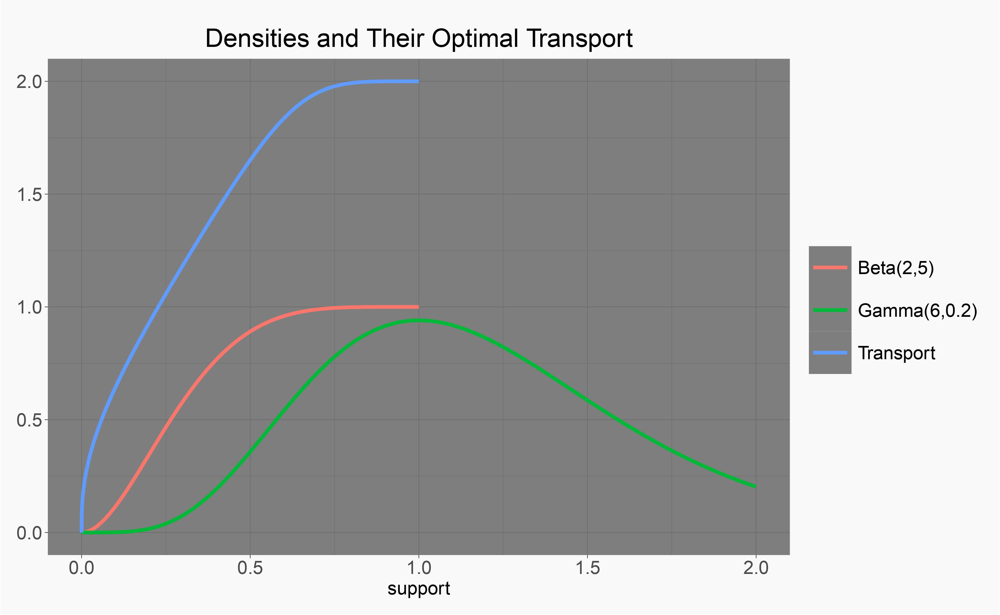
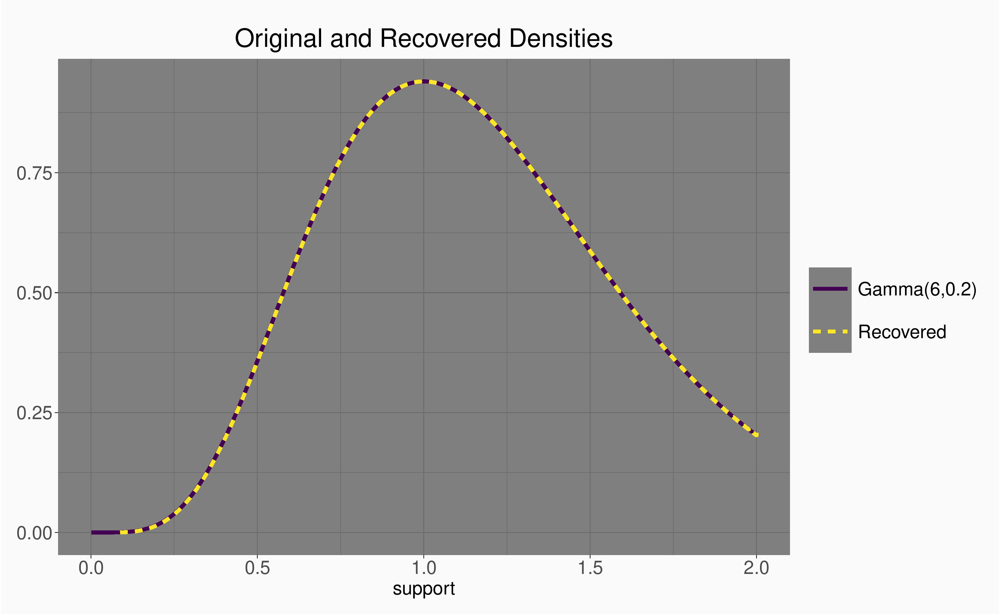

## Hello, probability density functions

Throughtout the course of history of statistical inference, estimating the data generative process constitues a significant thrust for methodology developments.  Probability density functions (pdfs), being one of the various characterizations of such underlying proccesses, become a natrual subject of study.  With the rapid adoption of modern sensors which collect high frequency signals, it is increasingly likely the case that each observed data sample is associated with its own distribution.  In this case, one is interested in studying the heterogeneity among the generating processes rather than the processes per se.  The shift from viewing pdfs as models of random observations to individual observations of a meta-generative process on the space of distributions is now hitting its stride.[^1]

## Ok, so what is so hard about modeling pdfs as data atoms?

Well, for starters, pdfs are intrinsically infinite-dimensional objects, which are rarely, if ever, fully observed.  In other words, a collection of measurable maps from an underlying probability space assumes values in a space of densities, and observable samples are further generated by the random mechanisms specified by these densities.  Therefore, estimation of densities needs to be done, and inccured deviations need to be accounted for.

To further complicate matters, densities do not constitue a vector space, which renders every single well-established linear methods hopeless.  Several attempts have been to clear these hurdles.  For instance, the LQD transformation, the Bayes space isomorphism, and the geometric approach with Wasserstein and Fisher-Rao metrics.

The rest of this post will focus on the case of the Wasserstein geometry.  While being admittedly biased as my recent work was centered in the Wasserstein geometry, I do believe this is a promising framework in this competitive landscape.

## Wasserstein geometry is also known as the eath mover's distance, so let's grab our shovels

A thorough account of the work behind the Wassersetin geometry is clearly beyond the scope of what this post aims to serve, so we will just look at the simple case of probability measures on $\mathbb{R}$ with finite second moments, i.e., $\mathcal{W}_2 = \\{ \mu: \int x \, \mathrm{d} \mu(x) <\infty\\}$.  Denote by $\mathcal{D}$ the subset of $\mathcal{W}_2$ which admits densities, i.e., absolute continuous with respect to the Lebesgue measure.

For any two measures $\mu$, $\nu \in \mathcal{W}_2$, with corresponding cumulative distribution functions (cdfs) $F$, $G$, respectively, the Wasserstein distance between the two distributions addmits a closed form

$$
d_W(F,G) = \int_0^1 (F^{-1}(s) - G^{-1}(s)) \mathrm{d}s.
$$

Denote $\mu\_{\oplus}$ the template measure of the random measures that take values in $\mathcal{W}\_2$.  There exists an isometric isomorphism between $\mathcal{W}\_2$ and the tangent space $\mathcal{T}\_{\mu\_\oplus}$, which is a separable Hilbert space -- this nice Hilbertian strucure does most of the heavy lifting.

We will skip forward a bit and jump to our main topic.  Suppose we have a template density $f\_{\oplus}$ and are able to obtain an optimal transport map $T = F^{-1} \circ F\_{\oplus}$ in tangent space centered at $f\_{\oplus}$ (the other cases will be updated later this week).  Let's take a look at how we can revocer the density pointed by $T$ from a numerical perspective.  We will used $u$ as elements in the support of $f\_{\oplus}$ and $s \in [0,1]$ throughout.

## Approach 1: D&I (differentiation and interpolation)

Below is a code example and plot where we set $f\_{\oplus}$ and $f$ to be $Beta(2,5)$ and truncated $Gamma(6,0.2)$ on $[0,2]$, respectively.

```R
# Approach 1.
gamma_1_support <- seq(0, 2, by = 0.001)
gamma_1_pdf <- dgamma(gamma_1_support, shape = 6, rate = 5)
gamma_1_pdf <- gamma_1_pdf/sum(gamma_1_pdf * 0.001)

beta_1_support <- seq(0, 1, by = 0.0005)
beta_1_pdf <- dbeta(beta_1_support, 2, 5)
beta_1_pdf <- beta_1_pdf/sum(beta_1_pdf * 0.0005)

beta_1_cdf <- cumsum(beta_1_pdf*0.0005)

# Optimal transport.
opt_1 <- approx(cumsum(gamma_1_pdf*0.001), gamma_1_support,
                xout = beta_1_cdf, method = "linear", rule = 2)
```

<div className="Image__Small">
  
</div>

Based on the definition $T(u) = F^{-1} \circ F\_{\oplus}(u)$, one can reply on the change of variable, $s = F\_{\oplus}(u)$ and obtain $F^{-1}(s)$ directly.  Invert the quantile function, take derivative on the cdf.  However, one needs to be mindful about the range of $T$.  If there are portions of $T$ with steep slopes, one needs to increase the sampling rate to ensure the derivative on the inverted $T$ preserves enough precision.  However, the range of $T$ is not directly under control.  Alternatively, a better approach is to rely on the following fact

$$
\frac{\mathrm{d}}{\mathrm{d} u} T(u) = \frac{\mathrm{d}}{\mathrm{d} u} F^{-1} \circ {F}\_{\oplus}(u) = \frac{{f}\_\oplus(u)}{f \circ T(u)} \Rightarrow  \frac{{f}\_\oplus(u)}{\frac{\mathrm{d}}{\mathrm{d} u} T(u)} = f \circ T(u).
$$

In other words, one simply takes the numerical differention of $T$, where the domain grid is under direct control, and then take reciprocal and multiply with the Wasserstein mean density.  Below is a code example and a plot demostrating that the recovered density overlays perfectly on the true density.

```R
# T'
opt_1_driv <- diff(opt_1$y)/0.0005
# Recover density.
target_pdf_1 <- beta_1_pdf[-1]/opt_1_driv
```

<div className="Image__Small">
  
</div>

## Approach 2: To be continued......